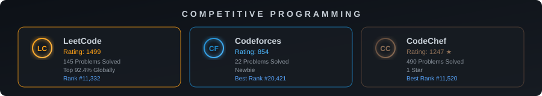

<!-- ═══════════════════════════════════════════════════════════════ -->
<!-- 🧠  VIGNESH V — AI/ML ENGINEER  •  FULL-STACK DEV  •  UI/UX  -->
<!-- ═══════════════════════════════════════════════════════════════ -->

<!-- Neural Network Animated Header -->

<!-- Animated Typing SVG -->

<!-- Visitor Badge & Profile Views -->
 

<!-- ═══════════════════════════════════════════════════════════════ -->
<!-- 🧬 ABOUT ME -->
<!-- ═══════════════════════════════════════════════════════════════ -->

 

##  &nbsp;About Me

> *AI/ML enthusiast building intelligent systems that blend cutting-edge technology with beautiful design.*

🎓 &nbsp;**B.E. CSE (AI & ML)** at KIT, Coimbatore — *CGPA: 8.05/10*  
🧠 &nbsp;Passionate about **Machine Learning, Deep Learning & Computer Vision**  
🎨 &nbsp;Former **UI/UX Design Intern** — Figma, Adobe XD, Illustrator  
🏆 &nbsp;**490+ problems** solved across competitive programming platforms  
🔭 &nbsp;Currently exploring **Generative AI & Large Language Models**  
📍 &nbsp;Based in **Tiruppur, Tamil Nadu, India**  
⚡ &nbsp;Fun fact: I debug neural networks *and* pixel-perfect UIs  

 

<!-- ═══════════════════════════════════════════════════════════════ -->
<!-- 🛠️ TECH STACK -->
<!-- ═══════════════════════════════════════════════════════════════ -->

##  &nbsp;Tech Arsenal

### 🧠 AI / ML / Data Science

### 🌐 Full-Stack Development

### 💻 Languages

### 🗄️ Databases & Cloud

### 🎨 Design & Tools

 

<!-- Skill Proficiency Bars -->

  

 

<!-- ═══════════════════════════════════════════════════════════════ -->
<!-- 🚀 FEATURED PROJECTS -->
<!-- ═══════════════════════════════════════════════════════════════ -->

##  &nbsp;Featured Projects

<table>
<tr>
<td width="50%" valign="top">

### 🤖 ViralSense AI

**AI-powered social media viral prediction system**

`Python` `Scikit-Learn` `Streamlit` `Pandas` `NumPy`

- 📊 Predicts future view counts using **Random Forest**
- 🎯 Determines virality based on engagement thresholds
- 📈 Interactive dashboards with best-time posting recommendations
- 🔄 Real-time content performance analysis

</td>
<td width="50%" valign="top">

### 👁️ Smart Face Attendance

**Real-time face recognition attendance system**

`Python` `OpenCV` `YOLOv8` `CNN` `ResNet50`

- 🎯 **ResNet50** for high-accuracy face embeddings
- ⚡ **YOLOv8** for real-time face detection
- 📹 Live video streaming with OpenCV
- ✅ Seamless automatic attendance marking

</td>
</tr>
<tr>
<td width="50%" valign="top">

### 🚐 ShuttleBooking Management

**Role-based shuttle booking platform**

`React.js` `React Router` `Context API` `CSS`

- 🔐 Role-based auth: Passengers, Owners, Admins
- 📊 Dynamic dashboards with shuttle search
- 🛡️ Protected routing & responsive UI
- 🚀 Smooth UX across all workflows

</td>
<td width="50%" valign="top">

### 🛒 PulseCart

**Feature-rich shopping cart simulation**

`Java 11+` `Java Swing` `File I/O` `OOP`

- 🏪 Full online retail platform simulation
- 🔑 Role-based user authentication
- 🔍 Search & personalized recommendations
- 🎨 Intuitive GUI with Java Swing

</td>
</tr>
</table>

 

<!-- ═══════════════════════════════════════════════════════════════ -->
<!-- 🏆 COMPETITIVE PROGRAMMING -->
<!-- ═══════════════════════════════════════════════════════════════ -->

##  &nbsp;Competitive Programming

  

 

 

<!-- ═══════════════════════════════════════════════════════════════ -->
<!-- 📜 CERTIFICATIONS -->
<!-- ═══════════════════════════════════════════════════════════════ -->

##  &nbsp;Certifications

| 🏅 Certification | 🏢 Issuer | 📅 Year |
|:---|:---|:---:|
| **Python Essentials 1** | Cisco Networking Academy | 2025 |
| **Python Essentials 2** | Cisco Networking Academy | 2025 |
| **Introduction to Cybersecurity** | Cisco Networking Academy | 2025 |

 

<!-- ═══════════════════════════════════════════════════════════════ -->
<!-- 💼 EXPERIENCE -->
<!-- ═══════════════════════════════════════════════════════════════ -->

##  &nbsp;Experience

<table>
<tr>
<td>

### 🎨 UI/UX Design Intern &nbsp;`May 2026 — Jun 2026`

- ✨ Designed user-centered digital interfaces using **Figma, Adobe XD, Canva, Photoshop & Illustrator**
- 📐 Created high-fidelity UI designs, reusable components & interactive prototypes
- 🔄 Focused on **usability, accessibility, typography & responsive layouts**
- 🤝 Collaborated on real-time design projects with design thinking methodologies

</td>
</tr>
</table>

 

<!-- ═══════════════════════════════════════════════════════════════ -->
<!-- 📊 GITHUB STATS -->
<!-- ═══════════════════════════════════════════════════════════════ -->

##  &nbsp;GitHub Analytics

 

  

<!-- Activity Graph -->

 

<!-- GitHub Trophies -->

  

 

<!-- ═══════════════════════════════════════════════════════════════ -->
<!-- 🐍 CONTRIBUTION SNAKE -->
<!-- ═══════════════════════════════════════════════════════════════ -->

  <picture>
    <source media="(prefers-color-scheme: dark)" srcset="https://raw.githubusercontent.com/Vignesh-61/Vignesh-61/output/github-snake-dark.svg" />
    <source media="(prefers-color-scheme: light)" srcset="https://raw.githubusercontent.com/Vignesh-61/Vignesh-61/output/github-snake.svg" />
    
  </picture>

 

<!-- ═══════════════════════════════════════════════════════════════ -->
<!-- 🤝 CONNECT WITH ME -->
<!-- ═══════════════════════════════════════════════════════════════ -->

##  &nbsp;Let's Connect

 

<!-- ═══════════════════════════════════════════════════════════════ -->
<!-- 🌊 FOOTER -->
<!-- ═══════════════════════════════════════════════════════════════ -->

  

<!-- ═══════════════════════════════════════════════════════════════ -->
